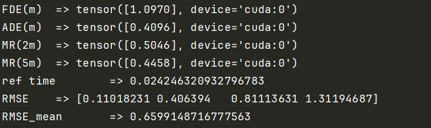
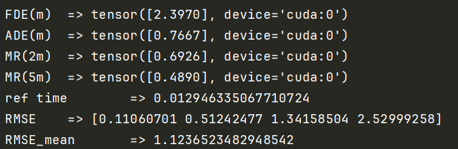

# ICMDT

[](#contributing)[](https://pytorch.org/)

This repo is the implementation of our paper. The code is based on Pytorch 2.1.1 and tested on Ubuntu 18.04, using an NVIDIA RTX 4060 GPU and 32 GB memory.  Once the paper is accepted, we will release all the source code. Follow the steps below to reproduce our experimental results.

## Demo

### 🛠️ Get started

### Set up a new virtual environment

```
conda create -n ICMDT python=3.10
conda activate ICMDT
pip install torch==2.1.1 torchvision==0.16.1 torchaudio==2.1.1 --index-url https://download.pytorch.org/whl/cu118
pip install -r ./requirements.txt
```

Other requirements:

- Ubuntu 18.04

### Install Mamba

We follow the settings outlined in [VideoMamba](https://github.com/OpenGVLab/VideoMamba).

```
git clone git@github.com:OpenGVLab/VideoMamba.git
cd VideoMamba
pip install -e causal-conv1d
pip install -e mamba
```

### 🔥 Evaluating

```
# Evaluate for submission of ICMDT
python evaluate_round.py
# Evaluate for submission of WSiP
cd baselines/WSiP
python evaluate.py
```

### Example output
The following is a screenshot of the results of running ICMDT:



The results of running WSiP:



:trophy: **SOTA performance**: From the above results, we can see that our model achieves better performance than WSiP. For convenience, we only provide a simple example here. For more comparative results, see the paper.

### Acknowledgements

Part of our code is borrowed from:

[](https://awesome.re)

[VideoMamba](https://github.com/OpenGVLab/VideoMamba)

[DeMo](https://github.com/fudan-zvg/DeMo.git)

[CS-LSTM](https://github.com/nachiket92/conv-social-pooling)

[WSiP](https://github.com/Chopin0123/WSiP.git)

[HLTP](https://github.com/Petrichor625/HLTP)

[STDAN](https://github.com/xbchen82/stdan)

We thank the authors for releasing their code and models.

